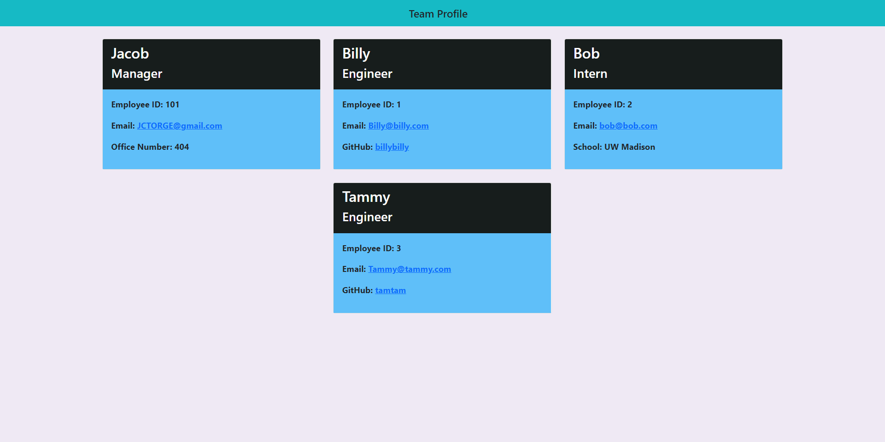

# Team Profile Generator

## Description
Using the Inquirer module from Node.js, this application was designed to produce a team profile based on user input and show the information on a newly created html page with a style sheet. This project uses Jest to explain OOP and TDD.

## Table of Contents
* [Installation](#installation)
* [Usage](#usage)
* [License](#license)
* [Contributing](#contributing)
* [Tests](#tests)
* [Questions](#questions)

## Installation 
The user should clone the repository from GitHub. Once cloned run the folling in the terminal to install required modules.
- "npm init"
- "npm install inquirer"
- "npm install jest"

## Usage 
Use inquirer from your command line to answer questions about your project.
View walk through video here - [Screencastify]() 

## License 
N/A

## Contributing 
Contributors should read the installation section. 

## Tests
In the command line type "npm run test" to run Jest for tests on constructors. 

## Questions
Any questions please contact at: 
Email: JCTORGE@gmail.com  
gitHub: t0rgy  
